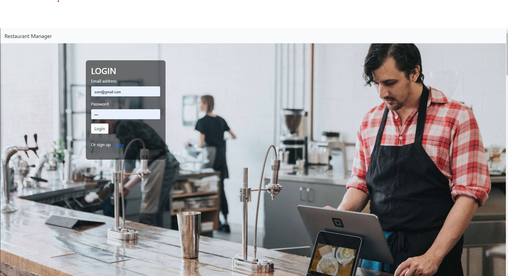
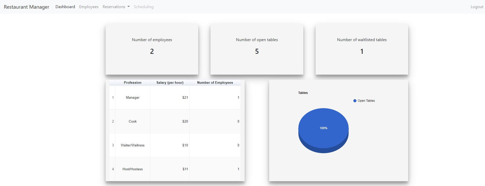
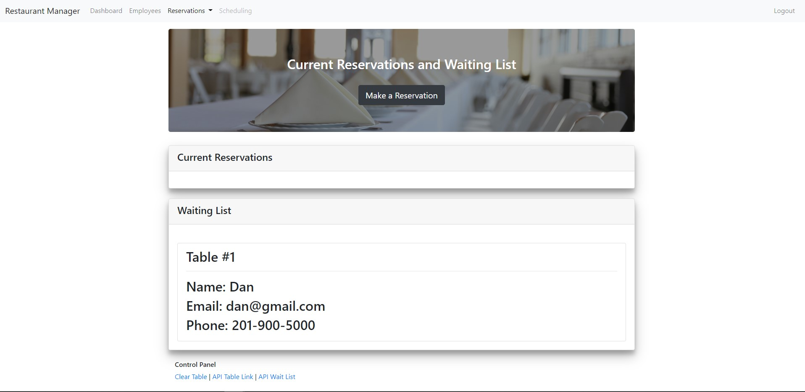

# Restaurant Manager :chart_with_downwards_trend:

An application where managers can track their employees. Users can import there name, hourly pay and job title. Allows managers at restaurants to view their employees and reservations.

## :clipboard: Table of contents
- [&#x1f527; Technologies & Tools](#-key-technology--tools)
- [&#x1f4f2; Features](#-features)
- [:framed_picture: Images](#framed_picture-images)

## &#x1f527; Key Technology & Tools

- HTML5
- CSS3
- Bootstrap
- JavaScript
  - jQuery
  - Node.js
  - Express.js
  - Sequelize
  - Passport
  - Jasmine
- Heroku

## &#x1f4f2; Features

- Managers can:
  - import their employees name, hourly pay and job title so they can view their employeees
  - book tables allowing them see if the restaurant has any open tables
- Displays charts depending on the data inputed of open tables and number of employees.

## :framed_picture: Images

